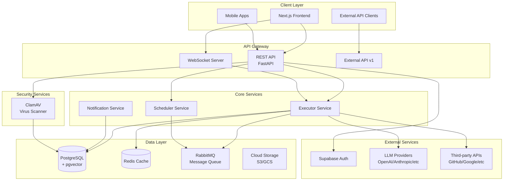
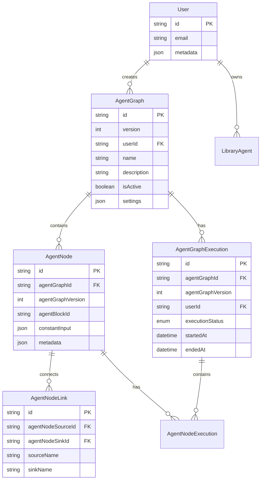
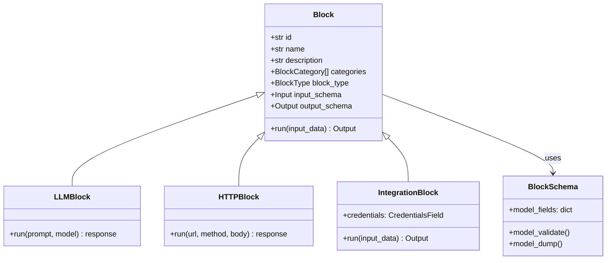
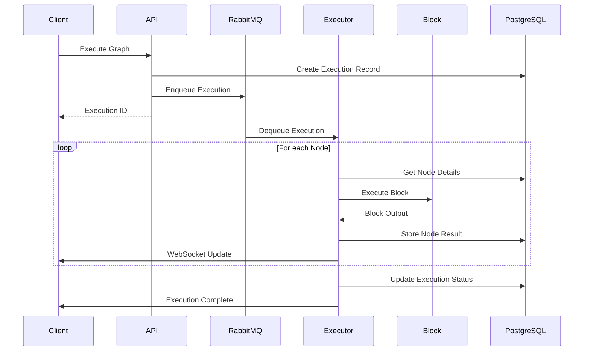
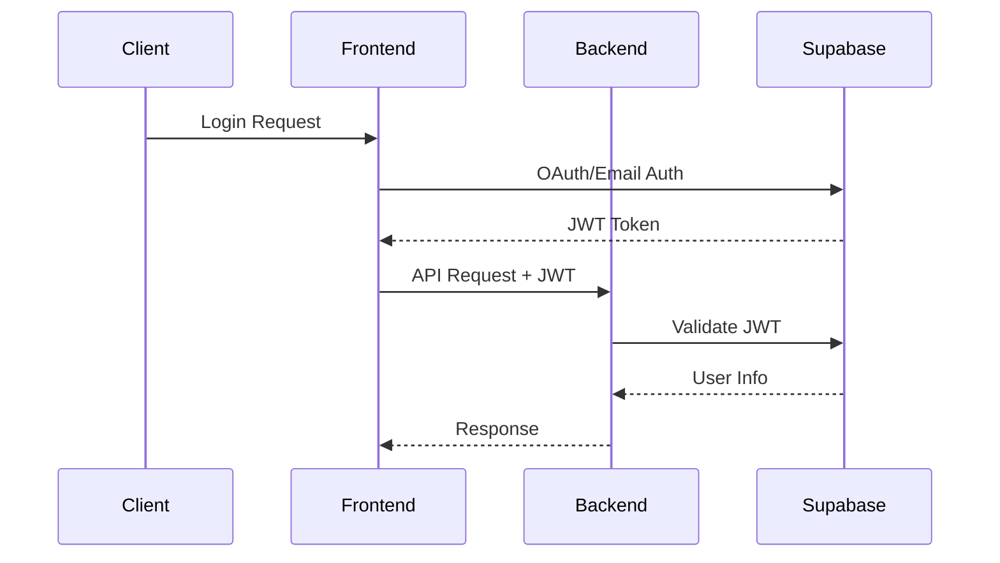

# AutoGPT Platform Architecture

> Comprehensive architecture documentation for the AutoGPT Platform

## System Overview



## Component Architecture

### 1. Frontend (Next.js 15)

```
frontend/src/
├── app/                    # Next.js App Router
│   ├── (platform)/        # Protected platform routes
│   │   ├── build/         # Agent builder/editor
│   │   ├── library/       # Agent library
│   │   ├── marketplace/   # Agent store
│   │   └── monitoring/    # Execution monitoring
│   └── api/
│       └── __generated__/ # Orval-generated API hooks
├── components/
│   ├── atoms/             # Basic UI elements
│   ├── molecules/         # Composite components
│   └── organisms/         # Complex feature components
├── lib/                   # Utilities
└── services/              # Business logic
```

**Key Technologies:**
- **Framework**: Next.js 15 with App Router
- **Data Fetching**: React Query + Orval-generated hooks
- **State**: React Query (server), Zustand (local)
- **Styling**: Tailwind CSS + shadcn/ui
- **Workflow Editor**: @xyflow/react

### 2. Backend (FastAPI)

```
backend/backend/
├── api/                   # API layer
│   ├── features/         # Feature-specific routes
│   │   ├── library/      # Agent library APIs
│   │   ├── builder/      # Graph building APIs
│   │   ├── store/        # Marketplace APIs
│   │   ├── executions/   # Execution management
│   │   ├── integrations/ # OAuth/credential APIs
│   │   └── chat/         # AI copilot
│   ├── external/         # Public API (v1)
│   └── middleware/       # Security middleware
├── blocks/               # Workflow blocks (224+)
├── data/                 # Data models & ORM
├── executor/             # Execution engine
├── integrations/         # OAuth & webhooks
└── util/                 # Utilities
```

**Key Technologies:**
- **Framework**: FastAPI with async support
- **ORM**: Prisma (PostgreSQL)
- **Queue**: RabbitMQ via pika/aio-pika
- **Cache**: Redis
- **Auth**: JWT + Supabase

## Data Models

### Core Entities



### Key Model Definitions

#### Graph (Agent Workflow)
```python
class Graph(BaseModel):
    id: str                          # Unique identifier
    version: int                     # Version number
    name: str                        # Display name
    description: str                 # Agent description
    is_active: bool                  # Currently active version
    nodes: list[Node]                # Workflow nodes
    links: list[Link]                # Node connections
    input_schema: dict               # Computed input schema
    output_schema: dict              # Computed output schema
```

#### Node (Workflow Block Instance)
```python
class Node(BaseModel):
    id: str                          # Unique identifier
    block_id: str                    # Reference to Block type
    input_default: dict              # Default input values
    metadata: dict                   # UI positioning, etc.
    input_links: list[Link]          # Incoming connections
    output_links: list[Link]         # Outgoing connections
```

#### Execution
```python
class GraphExecution(BaseModel):
    id: str                          # Execution ID
    graph_id: str                    # Agent graph ID
    graph_version: int               # Version executed
    user_id: str                     # Owner
    status: ExecutionStatus          # QUEUED/RUNNING/COMPLETED/FAILED
    started_at: datetime             # Start timestamp
    ended_at: datetime | None        # End timestamp
```

## Block Architecture

Blocks are the fundamental building units of agent workflows.



### Block Categories

| Category | Examples | Count |

|----------|----------|-------|
| **AI/LLM** | LLM, AI Condition, Smart Decision | 8+ |
| **Social Media** | Twitter, Discord, Ayrshare | 40+ |
| **Productivity** | Google, Notion, Airtable | 30+ |
| **Developer** | GitHub, Firecrawl, Exa | 25+ |
| **Media** | Image Gen, Video, TTS | 10+ |
| **Core** | HTTP, Text, Iteration, Branching | 20+ |

## Execution Engine



### Execution States

```
QUEUED → RUNNING → COMPLETED
              ↓
           FAILED
              ↓
         TERMINATED (user cancelled)
              ↓
           REVIEW (human-in-the-loop)
```

## Security Architecture

### Authentication Flow



### Security Layers

1. **Authentication**: JWT tokens via Supabase
2. **Authorization**: User ID checks on all data access
3. **Rate Limiting**: Per-user request limits
4. **Cache Protection**: No-cache headers on sensitive endpoints
5. **File Security**: ClamAV virus scanning for uploads
6. **Credential Security**: Encrypted credential storage

## API Architecture

### REST API Endpoints

| Feature | Prefix | Description |

|---------|--------|-------------|
| Library | `/api/v2/library` | Agent CRUD, presets |
| Builder | `/api/v2/builder` | Graph creation/execution |
| Store | `/api/v2/store` | Marketplace operations |
| Executions | `/api/v2/executions` | Run history, monitoring |
| Integrations | `/api/v2/integrations` | OAuth connections |
| Chat | `/api/v2/chat` | AI copilot |
| Admin | `/api/v2/admin` | Analytics, credits |

### WebSocket Events

```typescript
// Client → Server
{ type: "subscribe", execution_id: string }
{ type: "unsubscribe", execution_id: string }

// Server → Client
{ type: "execution.started", data: ExecutionMeta }
{ type: "execution.progress", data: NodeOutput }
{ type: "execution.completed", data: ExecutionResult }
{ type: "execution.failed", data: ErrorInfo }
```

## Deployment Architecture

### Docker Compose Stack

```yaml
services:
  rest_server:
    build: ./backend
    ports: ["8006:8006"]
    depends_on: [postgres, redis, rabbitmq]

  websocket_server:
    build: ./backend
    ports: ["8001:8001"]
    command: python -m backend.ws

  executor:
    build: ./backend
    ports: ["8002:8002"]
    command: python -m backend.exec

  scheduler:
    build: ./backend
    ports: ["8003:8003"]
    command: python -m backend.scheduler

  database_manager:
    build: ./backend
    ports: ["8005:8005"]
    command: python -m backend.db

  notification_server:
    build: ./backend
    ports: ["8007:8007"]
    command: python -m backend.notification

  frontend:
    build: ./frontend
    ports: ["3000:3000"]

  postgres:
    image: postgres:15
    ports: ["5432:5432"]
    volumes: [postgres_data:/var/lib/postgresql/data]

  redis:
    image: redis:7
    ports: ["6379:6379"]

  rabbitmq:
    image: rabbitmq:3-management
    ports: ["5672:5672", "15672:15672"]

  clamav:
    image: clamav/clamav-debian:latest
    ports: ["3310:3310"]
```

**Service Ports:**
- `8006` - REST API Server (main HTTP endpoints)
- `8001` - WebSocket Server (real-time updates)
- `8002` - Executor Service (workflow execution)
- `8003` - Scheduler Service (scheduled tasks)
- `8005` - Database Manager Service
- `8007` - Notification Service
- `3000` - Frontend (Next.js application)
- `5432` - PostgreSQL Database
- `6379` - Redis Cache
- `5672` - RabbitMQ (AMQP)
- `15672` - RabbitMQ Management UI
- `3310` - ClamAV Virus Scanner
```

### Environment Configuration

| Service | Config File | Purpose |

|---------|-------------|---------|
| Platform | `.env.default` | Shared defaults |
| Backend | `backend/.env` | API configuration |
| Frontend | `frontend/.env` | Client configuration |
| Docker | `docker-compose.yml` | Service orchestration |

## Scalability Considerations

### Horizontal Scaling

- **API Servers**: Stateless, scale behind load balancer
- **Executors**: Scale based on queue depth
- **WebSocket**: Sticky sessions or Redis pub/sub

### Vertical Scaling

- **PostgreSQL**: Read replicas for queries
- **Redis**: Cluster mode for high availability
- **RabbitMQ**: Mirrored queues for durability

### Performance Optimizations

1. **Caching**: Redis for frequently accessed data
2. **Connection Pooling**: Prisma connection management
3. **Async I/O**: Full async support in FastAPI
4. **Batch Processing**: Group related operations
5. **Vector Search**: pgvector for semantic search

## Integration Patterns

### OAuth Integration

```python
# OAuth flow for third-party services
class OAuthProvider:
    async def get_authorization_url() -> str
    async def exchange_code(code: str) -> Credentials
    async def refresh_token(refresh_token: str) -> Credentials
```

### Webhook Integration

```python
# Webhook handling for external triggers
class WebhookHandler:
    async def verify_signature(request) -> bool
    async def process_event(event) -> None
    async def trigger_execution(graph_id, input_data) -> str
```

## Monitoring & Observability

### Metrics (Prometheus)

- Request latency and throughput
- Execution queue depth
- Block execution times
- Error rates by block type

### Logging

- Structured JSON logs
- Request/response logging
- Execution tracing
- Error aggregation

### Alerting

- Execution failures
- Queue backlog
- API error spikes
- Resource exhaustion
