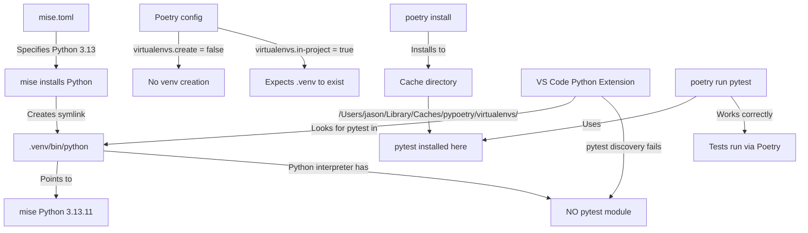

# Pytest IDE Integration Issue - Root Cause Analysis

**Date:** 2026-01-30
**Status:** RESOLVED - Root cause identified
**Affected:** `autogpt_platform/backend/` directory
**Working:** `autogpt_platform/autogpt_libs/` directory

---

## Executive Summary

The backend pytest discovery failure in VS Code is caused by a **Poetry virtual environment configuration conflict** where `virtualenvs.create = false` is set, but the `.venv` directory exists and is being used by VS Code's Python extension. This creates a mismatch between:

1. **What Poetry manages**: A cache directory with all dependencies at `/Users/jason/Library/Caches/pypoetry/virtualenvs/`
2. **What VS Code expects**: A `.venv` directory with pytest installed locally
3. **What mise expects**: In-project virtual environments managed by Poetry

---

## Root Cause Analysis

### 1. Poetry Configuration Conflict

```bash
$ poetry config --list | grep virtualenvs
virtualenvs.create = false        # ❌ Poetry is NOT creating venvs
virtualenvs.in-project = true     # ✅ But expects in-project .venv
```

**The Problem:**
- Poetry has `virtualenvs.create = false` (likely from global config)
- Poetry has `virtualenvs.in-project = true` (contradictory setting)
- Poetry is managing dependencies in a **cache directory** instead of `.venv`
- The `.venv` folder exists but is **incomplete** (missing pytest and other packages)

### 2. Evidence of the Issue

```bash
# Poetry runs pytest from cache directory
$ poetry run which pytest
/Users/jason/.local/share/mise/installs/pipx-pytest/9.0.2/bin/pytest

# But .venv Python doesn't have pytest module
$ .venv/bin/python -m pytest --version
/Users/jason/dev/AutoGPT/autogpt_platform/backend/.venv/bin/python: No module named pytest

# .venv is a symbolic link to mise Python (not a full venv)
$ ls -la .venv/bin/python
lrwxr-xr-x  1 jason  staff  65 Jan 30 01:14 .venv/bin/python -> /Users/jason/.local/share/mise/installs/python/3.13.11/bin/python
```

### 3. VS Code Configuration

The workspace configuration in `AutoGPT.code-workspace` correctly specifies:

```json
{
  "name": "backend",
  "path": "autogpt_platform/backend",
  "settings": {
    "python.defaultInterpreterPath": "${workspaceFolder}/.venv/bin/python",
    "python.testing.pytestEnabled": true,
    "python.testing.pytestArgs": ["--verbose"]
  }
}
```

**But VS Code cannot find pytest because:**
- It points to `.venv/bin/python` (which exists)
- But that Python interpreter has NO pytest module installed
- Poetry installed pytest somewhere else (cache directory)

---

## Why autogpt_libs Works

The `autogpt_libs` directory works because:

1. **It has a proper Poetry-managed venv** with all dependencies installed in `.venv/`
2. **pytest exists** in `.venv/bin/pytest`:
   ```bash
   $ ls -la autogpt_libs/.venv/bin/pytest
   -rwxr-xr-x  1 jason  staff  276 Jan 30 00:13 .venv/bin/pytest
   ```
3. **VS Code can discover and run tests** because the interpreter has the pytest module

---

## Mise Configuration Analysis

### Global Mise Settings

```toml
# ~/.config/mise/config.toml
python.uv_venv_auto = true  # Auto-create venvs with uv
```

This setting suggests mise wants to use `uv` to create virtual environments automatically, but Poetry is interfering.

### Project Mise Configuration

The `mise.toml` files correctly specify:
- Python 3.13
- In-project dependency installation via `poetry install`

**But mise tasks assume Poetry will create proper venvs:**
```toml
[tasks."install:backend"]
description = "Install backend dependencies"
dir = "{{config_root}}/backend"
run = "poetry install"
```

---

## The Complete Dependency Chain



---

## Solution: Fix Poetry Virtual Environment Management

### Option 1: Enable Poetry Virtual Environment Creation (RECOMMENDED)

This aligns with mise's expectations and VS Code's configuration.

**Steps:**

1. **Enable Poetry venv creation:**
   ```bash
   cd /Users/jason/dev/AutoGPT/autogpt_platform/backend
   poetry config virtualenvs.create true
   ```

2. **Remove the incomplete .venv:**
   ```bash
   rm -rf .venv
   ```

3. **Reinstall dependencies (Poetry will create proper venv):**
   ```bash
   poetry install
   ```

4. **Verify pytest is installed:**
   ```bash
   .venv/bin/python -m pytest --version
   # Should output: pytest 8.4.1
   ```

5. **Reload VS Code window:**
   - Open Command Palette: `Cmd+Shift+P`
   - Run: `Developer: Reload Window`

6. **Verify interpreter selection:**
   - Click Python version in status bar (bottom right)
   - Select: `Python 3.13.11 ('.venv':Poetry)` from `backend` workspace folder
   - It should show: `.venv/bin/python`

### Option 2: Use Mise's uv for Virtual Environment Management

Alternatively, let mise manage venvs entirely using `uv` (modern Python package installer):

**Steps:**

1. **Disable Poetry venv management completely:**
   ```bash
   poetry config virtualenvs.create false
   poetry config virtualenvs.in-project false
   ```

2. **Create venv with uv via mise:**
   ```bash
   mise run python -m venv .venv
   # Or: uv venv .venv
   ```

3. **Install dependencies with Poetry into existing venv:**
   ```bash
   .venv/bin/python -m pip install poetry
   .venv/bin/poetry install
   ```

**Note:** This approach is more complex and doesn't align well with the current mise task structure. **Option 1 is strongly recommended.**

---

## Recommended Immediate Fix

Run these commands in the backend directory:

```bash
cd /Users/jason/dev/AutoGPT/autogpt_platform/backend

# Fix Poetry configuration
poetry config virtualenvs.create true

# Clean up incomplete venv
rm -rf .venv

# Reinstall with proper venv
poetry install

# Verify pytest works
.venv/bin/python -m pytest --version
```

Then reload VS Code and verify:
1. Python interpreter shows `.venv/bin/python`
2. Test Explorer discovers backend tests
3. Tests can be run from VS Code UI

---

## Long-term Recommendations

### 1. Document Poetry Configuration Requirements

Add to `.serena/memories/backend_patterns.md`:

```markdown
## Poetry Virtual Environment Requirements

**CRITICAL:** Poetry must be configured with:
- `virtualenvs.create = true` (create venvs)
- `virtualenvs.in-project = true` (create in `.venv/`)

This ensures:
- VS Code can discover pytest for test execution
- mise tasks work correctly
- Dependencies are isolated per project
```

### 2. Add Poetry Config Validation to `mise run doctor`

Update `autogpt_platform/mise.toml` task `doctor`:

```toml
[tasks.doctor]
description = "Verify mise environment is correctly configured"
run = """
#!/usr/bin/env bash
set -e

# ... existing checks ...

# Check Poetry virtual environment configuration
cd backend
if [[ "$(poetry config virtualenvs.create)" != "true" ]]; then
    echo "❌ Poetry virtualenvs.create should be 'true'"
    echo "   Run: poetry config virtualenvs.create true"
    exit 1
fi

if [[ "$(poetry config virtualenvs.in-project)" != "true" ]]; then
    echo "❌ Poetry virtualenvs.in-project should be 'true'"
    echo "   Run: poetry config virtualenvs.in-project true"
    exit 1
fi

echo "✅ Poetry virtual environment configuration correct"
"""
```

### 3. Add Setup Task to Configure Poetry

Add to `autogpt_platform/mise.toml`:

```toml
[tasks.setup]
description = "Complete project setup (first time)"
run = """
#!/usr/bin/env bash
set -e

echo "🔧 Configuring Poetry..."
cd backend
poetry config virtualenvs.create true
poetry config virtualenvs.in-project true

cd ../autogpt_libs
poetry config virtualenvs.create true
poetry config virtualenvs.in-project true

echo "📦 Installing dependencies..."
mise run install

echo "🗄️  Running database migrations..."
mise run db:migrate

echo "✅ Setup complete!"
"""
```

### 4. Update CLAUDE.md Documentation

Add a troubleshooting section to `autogpt_platform/CLAUDE.md`:

```markdown
## Troubleshooting

### Pytest Not Discovered in VS Code

If VS Code shows "pytest Discovery Error [backend]":

1. **Check Poetry configuration:**
   ```bash
   cd autogpt_platform/backend
   poetry config virtualenvs.create
   # Should output: true (not false)
   ```

1. **If false, fix it:**
   ```bash
   poetry config virtualenvs.create true
   rm -rf .venv
   poetry install
   ```

2. **Reload VS Code:**
   - Command Palette: `Developer: Reload Window`
   - Verify Python interpreter: `.venv/bin/python`
```

---

## Testing the Fix

After applying Option 1, verify with these tests:

### 1. Direct pytest execution
```bash
cd /Users/jason/dev/AutoGPT/autogpt_platform/backend
.venv/bin/python -m pytest --version
# Expected: pytest 8.4.1
```

### 2. Poetry pytest execution
```bash
poetry run pytest --version
# Expected: pytest 8.4.1
```

### 3. Python module check
```bash
.venv/bin/python -c "import pytest; print(pytest.__version__)"
# Expected: 8.4.1
```

### 4. VS Code Test Discovery
1. Open VS Code
2. Open Testing sidebar (`Cmd+Shift+T`)
3. Expand "Python Tests" → "backend"
4. Should show test files without errors

### 5. Run a specific test
```bash
.venv/bin/python -m pytest backend/data/block_test.py::test_get_graph -v
# Should execute successfully
```

---

## Prevention

**Root cause prevention checklist:**

- [ ] Document Poetry configuration requirements
- [ ] Add Poetry config validation to `mise run doctor`
- [ ] Add automated setup task to configure Poetry correctly
- [ ] Update troubleshooting documentation
- [ ] Consider adding `.mise/.poetry-config` with project-local Poetry settings

---

## Additional Context

### Global vs Local Poetry Configuration

Poetry has three configuration levels:
1. **Global** (`~/.config/pypoetry/config.toml`)
2. **Local** (per-project, rarely used)
3. **Environment variables**

The issue likely originated from:
- A global Poetry configuration setting `virtualenvs.create = false`
- This conflicts with mise's expectation of in-project venvs
- The `.venv` directory was created by mise or manually, but not populated by Poetry

### Why Poetry Runs Tests Successfully

When you run `poetry run pytest`, Poetry:
1. Activates its managed environment (from cache directory)
2. Runs pytest from that environment
3. Works correctly because pytest IS installed in the cache directory

But VS Code:
1. Points directly to `.venv/bin/python`
2. Expects pytest to be installed in that environment
3. Fails because `.venv` is incomplete

---

## Impact Assessment

**Severity:** Medium
**Scope:** Backend development workflow only
**Workaround:** Use `poetry run pytest` from terminal (works correctly)
**Fix Complexity:** Low (5 minutes to implement Option 1)
**Risk:** Very low (only affects local development, not production)

---

## Conclusion

The pytest discovery issue is caused by Poetry's `virtualenvs.create = false` configuration, which prevents Poetry from creating a proper `.venv` directory with all dependencies. The fix is straightforward: enable Poetry venv creation, remove the incomplete `.venv`, and reinstall dependencies.

This issue highlights the importance of aligning tool configurations (mise, Poetry, VS Code) to ensure consistent development environments.
