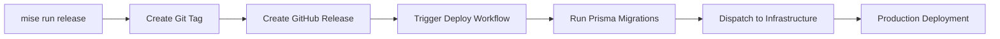

# AutoGPT Platform Release Process

This document describes the automated release process for the AutoGPT Platform monorepo.

## Overview

The AutoGPT Platform uses automated release management that:
- Synchronizes versions across all 3 packages (frontend, backend, libs)
- Creates semantic version tags
- Generates GitHub releases
- Triggers production deployment workflows

## Quick Start

### Prerequisites

1. **Clean working directory**: All changes must be committed
2. **GitHub CLI authenticated**: Run `gh auth login` if needed
3. **mise installed**: See [mise setup](../autogpt_platform/CLAUDE.md#development-with-mise)

### Creating a Release

```bash
# Interactive release (recommended for first time)
mise run release

# Auto-confirm patch release
mise run release:patch

# Auto-confirm minor release
mise run release:minor

# Auto-confirm major release
mise run release:major

# Specify exact version
mise run release v1.2.3
```

## Release Workflow

### 1. Version Synchronization Check

The script first checks if all 3 version files are synchronized:
- `autogpt_platform/frontend/package.json`
- `autogpt_platform/backend/pyproject.toml`
- `autogpt_platform/autogpt_libs/pyproject.toml`

**If versions are out of sync**, the script will:
1. Display current versions for each package
2. Suggest synchronizing to the highest current version
3. Prompt for confirmation or custom version
4. Update all 3 files atomically
5. Commit the synchronization

**Example output:**
```
Version mismatch detected:
  Frontend: 0.3.4
  Backend:  0.6.22
  Libs:     0.2.0

Recommended: Synchronize to v0.6.22 (highest current version)
Alternatively: Start fresh at v1.0.0

Synchronize to v0.6.22? [Y/n]
```

### 2. Version Increment

The script determines the next version based on:
- **Current version**: Synchronized version from step 1
- **Increment type**: major, minor, or patch (default: patch)

**Semantic versioning rules:**
- `major`: Breaking changes (v1.2.3 → v2.0.0)
- `minor`: New features (v1.2.3 → v1.3.0)
- `patch`: Bug fixes (v1.2.3 → v1.2.4)

### 3. Release Notes Generation

The script automatically generates release notes from git commits since the last tag:
```bash
git log v1.2.3..HEAD --pretty=format:"- %s" --no-merges
```

**Example release notes:**
```
- feat(backend): add user authentication API
- fix(frontend): resolve workflow builder crash
- chore: update dependencies
```

### 4. Atomic Version Update

All 3 version files are updated simultaneously:
- `package.json`: Uses Node.js to preserve JSON formatting
- `pyproject.toml` (backend): Uses sed for TOML updates
- `pyproject.toml` (libs): Uses sed for TOML updates

### 5. Git Tag and GitHub Release

The script creates:
1. **Git commit**: `chore: bump version to X.Y.Z`
2. **Git tag**: `vX.Y.Z` with annotated message
3. **GitHub release**: Using `gh release create` with generated notes

### 6. Deployment Trigger

The GitHub release triggers `.github/workflows/platform-autogpt-deploy-prod.yml`:
1. Runs Prisma database migrations
2. Dispatches deployment to infrastructure repository

## Usage Examples

### First Release (Version Sync Required)

**Scenario**: Packages are at different versions (0.2.0, 0.3.4, 0.6.22)

```bash
$ mise run release

=== AutoGPT Platform Release ===

Version mismatch detected:
  Frontend: 0.3.4
  Backend:  0.6.22
  Libs:     0.2.0

Recommended: Synchronize to v0.6.22 (highest current version)
Alternatively: Start fresh at v1.0.0

Synchronize to v0.6.22? [Y/n] Y

Updating all version files...
  ✓ Updated frontend/package.json → 0.6.22
  ✓ Updated backend/pyproject.toml → 0.6.22
  ✓ Updated autogpt_libs/pyproject.toml → 0.6.22

✓ Versions synchronized to: v0.6.22
Latest git tag: v0.0.0

Next version will be: v0.6.23

Options:
  [Enter] Accept v0.6.23 (patch increment)
  major   Increment major version
  minor   Increment minor version
  vX.Y.Z  Specify exact version
  q       Quit

Your choice: 1.0.0

Creating release: v1.0.0

Release notes:
- Initial release with synchronized monorepo versioning

Proceed with release? [y/N] y

Updating all version files...
  ✓ Updated frontend/package.json → 1.0.0
  ✓ Updated backend/pyproject.toml → 1.0.0
  ✓ Updated autogpt_libs/pyproject.toml → 1.0.0

Creating tag...
Pushing changes and tag...
Creating GitHub release...

✓ Release v1.0.0 created successfully!
```

### Subsequent Releases (Synchronized Versions)

**Scenario**: All packages are at v1.0.0

```bash
# Auto-confirm minor release
$ mise run release:minor

=== AutoGPT Platform Release ===

✓ Versions synchronized: v1.0.0
Latest git tag: v1.0.0

Creating release: v1.1.0

Release notes:
- feat(backend): add webhook support
- feat(frontend): improve graph editor UI
- fix(libs): resolve authentication edge case

Updating all version files...
  ✓ Updated frontend/package.json → 1.1.0
  ✓ Updated backend/pyproject.toml → 1.1.0
  ✓ Updated autogpt_libs/pyproject.toml → 1.1.0

Creating tag...
Pushing changes and tag...
Creating GitHub release...

✓ Release v1.1.0 created successfully!
```

## Release Task Reference

| Task | Description | Confirmation | Example |
|------|-------------|--------------|---------|
| `mise run release` | Interactive release with prompts | Interactive | Prompts for version type |
| `mise run release:patch` | Auto-increment patch version | Auto-confirmed | v1.2.3 → v1.2.4 |
| `mise run release:minor` | Auto-increment minor version | Auto-confirmed | v1.2.3 → v1.3.0 |
| `mise run release:major` | Auto-increment major version | Auto-confirmed | v1.2.3 → v2.0.0 |
| `mise run release v1.2.3` | Specify exact version | Interactive | Set to v1.2.3 |
| `mise run release --yes` | Skip confirmation prompt | Auto-confirmed | Accept defaults |

## Troubleshooting

### Error: Working directory is not clean

**Cause**: Uncommitted changes in the repository

**Solution**:
```bash
# View uncommitted changes
git status

# Commit changes
git add .
git commit -m "chore: prepare for release"

# Or stash changes
git stash
```

### Error: gh CLI not authenticated

**Cause**: GitHub CLI not configured

**Solution**:
```bash
gh auth login
# Follow interactive prompts to authenticate
```

### Error: Version files not found

**Cause**: Script run from wrong directory

**Solution**: The script must be run from workspace root using mise:
```bash
# Correct
cd /path/to/AutoGPT
mise run release

# Incorrect
cd /path/to/AutoGPT/autogpt_platform
../scripts/release.sh  # Won't find files
```

### Version Synchronization Failed

**Cause**: Node.js not available or sed incompatibility

**Solution**:
```bash
# Verify Node.js is installed
node --version

# If missing, install via mise
mise install node
```

### Release Already Exists

**Cause**: Git tag already exists for this version

**Solution**:
```bash
# List existing tags
git tag -l

# Delete tag if needed (caution!)
git tag -d v1.2.3
git push origin :refs/tags/v1.2.3

# Or create new version
mise run release:patch  # Increment to next version
```

## Rollback Procedures

### Rollback a Release

If a release needs to be rolled back:

1. **Delete the GitHub release**:
   ```bash
   gh release delete v1.2.3
   ```

2. **Delete the git tag**:
   ```bash
   git tag -d v1.2.3
   git push origin :refs/tags/v1.2.3
   ```

3. **Revert version commits**:
   ```bash
   git log --oneline  # Find commit SHAs
   git revert <sha>   # Revert version bump commit
   git push
   ```

4. **Manual version restoration** (if needed):
   ```bash
   # Edit version files manually
   vim autogpt_platform/frontend/package.json
   vim autogpt_platform/backend/pyproject.toml
   vim autogpt_platform/autogpt_libs/pyproject.toml

   git commit -am "chore: restore version to X.Y.Z"
   ```

### Deployment Rollback

If deployment fails after release:

1. Check workflow status:
   ```bash
   gh run list --workflow=platform-autogpt-deploy-prod.yml
   ```

2. View failed workflow logs:
   ```bash
   gh run view <run-id>
   ```

3. Coordinate with infrastructure team for deployment rollback

## Best Practices

### Conventional Commits

Use conventional commit format for meaningful release notes:
```bash
# Good commits (appear in release notes)
git commit -m "feat(backend): add webhook support"
git commit -m "fix(frontend): resolve graph editor crash"
git commit -m "perf(libs): optimize authentication cache"

# Skip in release notes (use --no-merges)
git commit -m "Merge pull request #123"
```

### Release Timing

- **Patch releases**: Can be created anytime for bug fixes
- **Minor releases**: Coordinate with team for feature announcements
- **Major releases**: Requires planning for breaking changes

### Version Strategy

- Start at `v1.0.0` for production-ready platform
- Use `v0.x.y` for pre-production development
- Follow [Semantic Versioning 2.0.0](https://semver.org/)

### Pre-Release Testing

Before creating a release:
```bash
# Run all tests
mise run test

# Verify linting
mise run format

# Test backend
mise run test:backend

# Test frontend E2E
mise run test:frontend
```

## Integration with CI/CD

### Workflow Trigger

The release process triggers `.github/workflows/platform-autogpt-deploy-prod.yml`:

```yaml
on:
  release:
    types: [published]
```

### Deployment Flow



## Related Documentation

- [Conventional Commits](https://www.conventionalcommits.org/)
- [Semantic Versioning](https://semver.org/)
- [GitHub CLI Releases](https://cli.github.com/manual/gh_release)
- [Mise Task Documentation](https://mise.jdx.dev/tasks/)
- [Platform CLAUDE.md](../autogpt_platform/CLAUDE.md)

## Support

For release process issues:
1. Check this documentation
2. Review troubleshooting section
3. Contact platform team via GitHub issues
4. Check workflow logs: `gh run list --workflow=platform-autogpt-deploy-prod.yml`
